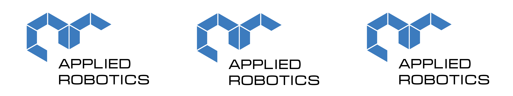



  

<!-- Social icons section -->

  
  &#8287;&#8287;&#8287;&#8287;&#8287;
  
  

  

  
  &#8287;&#8287;&#8287;&#8287;&#8287;
  
  &#8287;&#8287;&#8287;&#8287;&#8287;
  
  &#8287;&#8287;&#8287;&#8287;&#8287;
  
  &#8287;&#8287;&#8287;&#8287;&#8287;
<!-- Repo icons section -->
<h1>Линейки продукций</h1>

<h2>Образовательные решения</h2>

<blockquote>
  

<h3>Конструктор программируемых моделей инженерных систем</h3>

  <blockquote>
    

<h4>Конструктор программируемых моделей инженерных систем. Экспертный набор</h4>

      

      
      
      
      

      

      

<h4>Конструктор программируемых моделей инженерных систем. Информационные системы и устройства</h4>

      

      
      

      

      

<h4>Конструктор программируемых моделей инженерных систем. Кибернетический конструктор по робототехнике</h4>

      

      
      

      

  </blockquote>
  

  

<h3>СТЕМ Мастерская</h3>

  <blockquote>
    

<h4>Образовательный робототехнический комплект "СТЕМ Мастерская". Экспертный набор</h4>

      

        
        
      

    

    

<h4>Образовательный робототехнический комплект "СТЕМ Мастерская. Продвинутый"</h4>

      

        
        
      

    

  </blockquote>
  

  

<h3>Манипуляционные РТК</h3>

  <blockquote>
    

<h4>Учебно-лабораторный комплект "Учебный манипулятор с плоско-параллельной кинематикой</h4>

      

        
        
      

    

    

<h4>Dobot</h4>

      

        
        
      

    

    

        
      

  </blockquote>
  

</blockquote>

<h2>БАС и БПЛА</h2>

    <blockquote>
    

    
    

  </blockquote>

<h2>Мобильные РТК</h2>

<blockquote>
    

<h3>Учебный комплект на базе TurtleBot3</h3>

    

      
      
      
      <!--  -->
    

  

  

<h3>Учебный мобильный робот TurtleCar</h3>

    

      
    

  

</blockquote>

<h2>Электроника</h2>

<blockquote>

  

<h3>Системы технического зрения</h3>

  <blockquote>
      

<h4>AR-Stereo</h4>

      

        
      

    

    

<h4>SVCAM</h4>

      

        
      

    

    

<h4>Tracing Cam v3</h4>

      

        
        
      

    

  </blockquote>
  

  

<h3>Программируемы контроллеры</h3>

  <blockquote>
      

<h4>КПМИС</h4>

      

        
      

    

    

<h4>DXL_IOT</h4>

      

        
      

    

    

<h4>ESP JS AR</h4>

      

        
        
        
        
        
        
        
      

    

  </blockquote>
  

</blockquote>

<h2>Програмное обеспечение</h2>

  <blockquote>
    

    
    
    
    
    
    
    

  </blockquote>

<h2>Библиотеки</h2>

  <blockquote>
    

    
    
    
    
    
    
    

  </blockquote>

